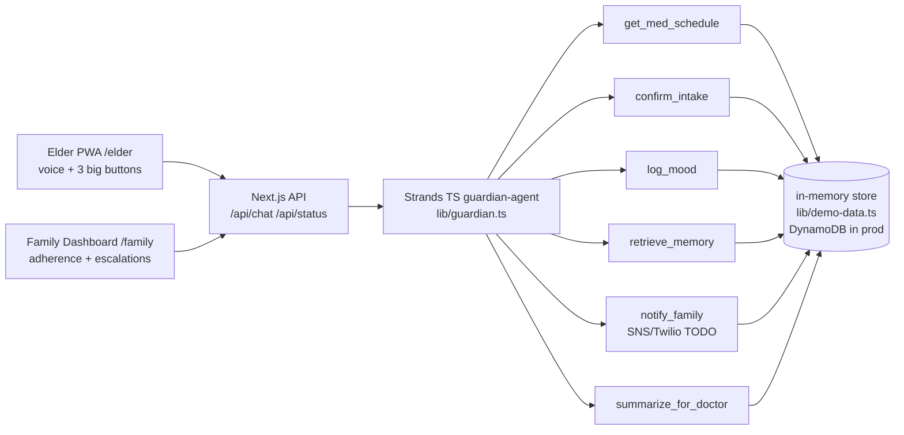

# Architecture (single TypeScript codebase)

**Autonomous loop:** scheduled check-in → med confirm → mood scan → memory moment → escalate (info/attention/urgent) only on threshold.

**Fallback:** without AWS creds, `fallbackReply()` handles demo deterministically. With creds, Strands Bedrock agent reasons with tools.
