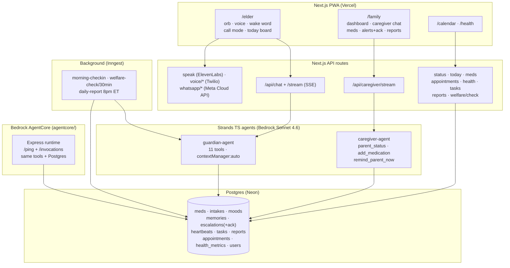

# Architecture — ElderLove (single TypeScript codebase + AgentCore service)

**Autonomous loops (the Everyday-Agents thesis — quiet until a real decision):**
1. Morning check-in → med confirm → mood scan → memory moment → escalate only on threshold.
2. Welfare sweep: every elder message is a heartbeat; silence past threshold → nudge → urgent + call. Nights excluded.
3. Alert acknowledgment: unconfirmed attention/urgent re-fires until a human taps "I'm on it".
4. Double-dose guard: same-day re-log refused, Ruth stopped firmly, attempt written to family trail.
5. Evening digest: adherence/mood/alerts/tasks → WhatsApp + email + saved report.

**Fallbacks (demo never dies):** no AWS creds → rule-based replies + word-chunked SSE;
no DB → in-memory store; no Twilio → WhatsApp voice; no WhatsApp → dashboard escalation.
Every channel degrades one step down, never silent.
