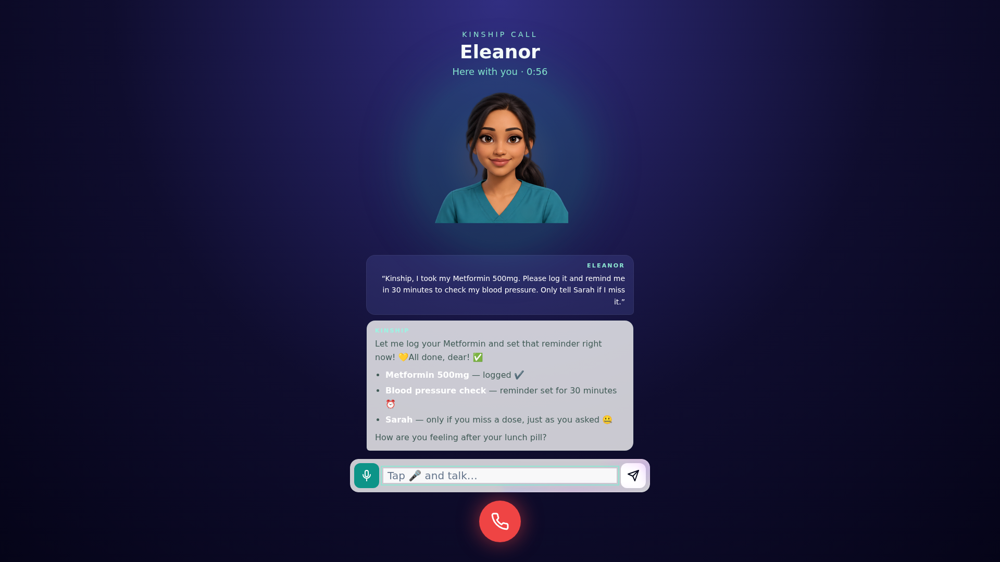
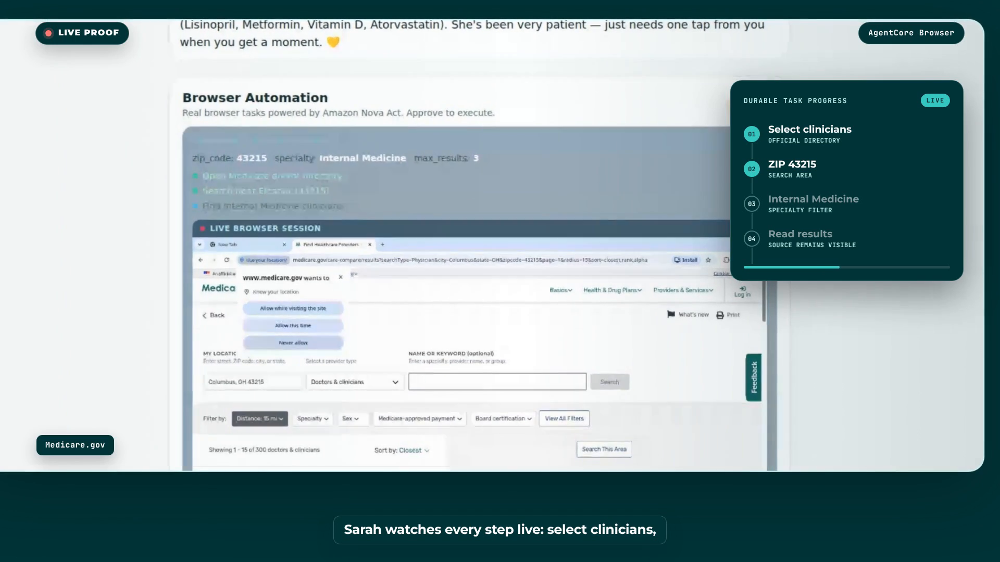
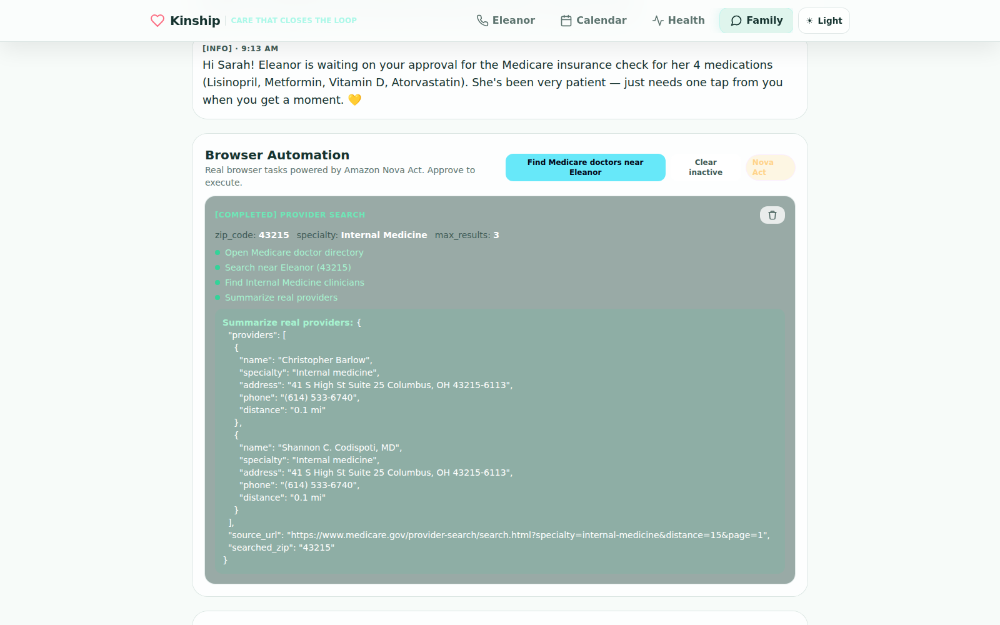
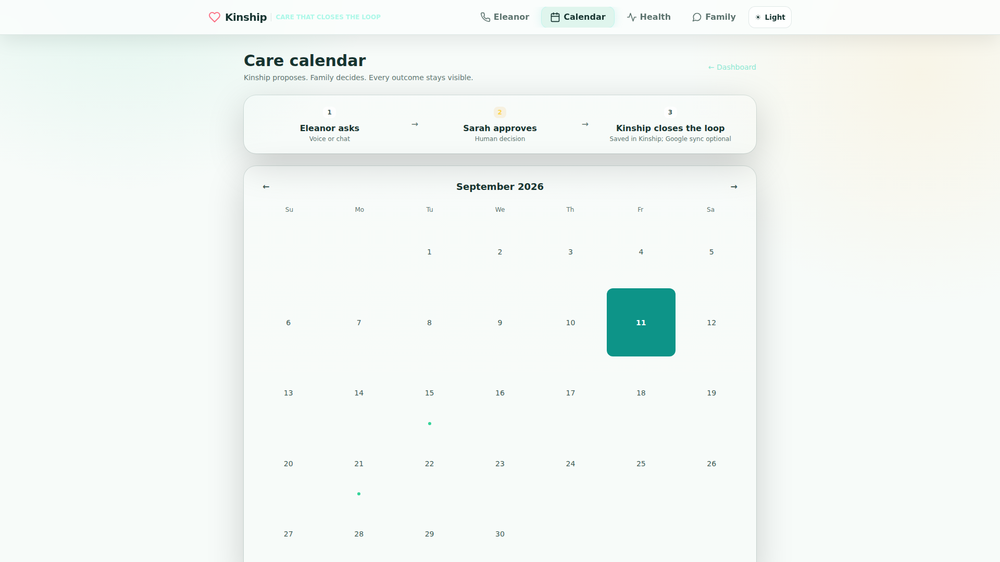
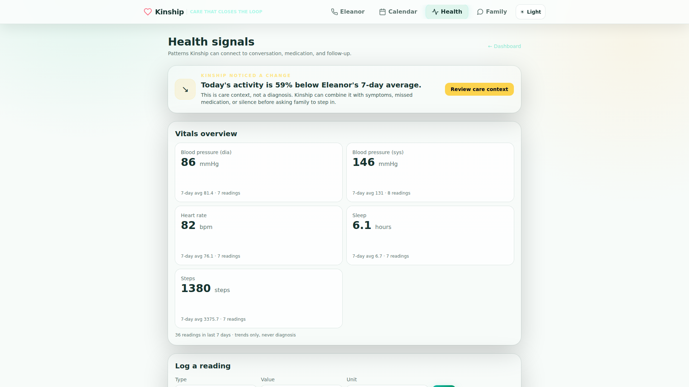

# Building Kinship: A Voice AI Agent That Logs Medications, Runs Follow-Ups, and Finds Medicare Doctors

Family caregiving rarely looks like one dramatic emergency. It looks like dozens of small questions repeated every day:

- Did Mom take her medication?
- Is today’s silence normal?
- Was the appointment confirmed?
- Which nearby doctor accepts Medicare?
- Did anybody follow up?

The individual tasks are small. Together, they become a second shift.

Most care software detects a problem and sends another notification. That still leaves the caregiver responsible for interpreting the alert, finding the right website, completing the task, and remembering the result.

For the AWS Agents for Humans Hackathon, I built **Kinship**, a voice-first care companion for older adults and a decision surface for their families.

In one sentence: **Kinship talks with older adults, logs medications, schedules and monitors follow-ups, and uses Amazon Nova Act to complete caregiver-approved tasks such as finding Medicare doctors—alerting family only when a risk or real decision needs them.**

Kinship is designed around one operating principle:

> Handle the repetition quietly. Protect the human decision. Close the loop.



## A real care loop

The demo follows Eleanor, 79, and her daughter Sarah.

In the production app, Eleanor tells Kinship:

> “I took my Metformin 500mg. Please log it and remind me in 30 minutes to check my blood pressure. Only tell Sarah if I miss it.”

Kinship does not merely answer. It streams the response, records the medication through a typed tool, creates a durable background reminder, and explains the notification boundary.

The call can end, but the promise remains.


Sarah can see the task without supervising it. Kinship only needs to interrupt her if Eleanor misses the follow-up or a consequential decision requires approval.

That pattern—conversation becoming durable, visible work—is the core of Kinship.

## Why Strands Agents SDK

Kinship uses the Strands Agents SDK for TypeScript. The guardian agent coordinates tools for:

- Medication schedules and intake confirmation
- Mood, memories, symptoms, and health trends
- Durable reminders and welfare checks
- Caregiver notifications and doctor summaries
- Appointment proposals
- Approved browser tasks

Each tool has a Zod input schema and a narrow responsibility. For example, medication confirmation is not a free-form database write. It resolves the current caregiver-managed schedule, accepts natural spoken labels, refuses duplicate same-day intake, and records a prevented double-dose attempt.

```typescript
export const confirmIntake = tool({
  name: "confirm_intake",
  inputSchema: z.object({
    userId: z.string(),
    medId: z.string(),
  }),
  callback: async (input) => {
    const taken = await takenMedIds(input.userId);
    const meds = await listMeds(input.userId);
    const key = input.medId.trim().toLowerCase();
    const med = meds.find((item) =>
      item.active &&
      [item.id, item.name, item.label, `${item.name} ${item.dosage}`]
        .filter(Boolean)
        .some((value) => value.trim().toLowerCase() === key)
    );
    if (!med) return JSON.stringify({ ok: false, error: "Medication not found." });
    if (taken.includes(med.id)) {
      await addEscalation(input.userId, "attention",
        `Double-dose prevented: Eleanor tried to log ${med.name} again.`);
      return JSON.stringify({ ok: false, alreadyTaken: true });
    }
    await storeConfirmIntake(input.userId, med.id, "agent");
    return JSON.stringify({ ok: true });
  },
});
```

Amazon Bedrock provides reasoning and tool selection. Strands gives the model a controlled way to act on care state rather than merely describe what somebody should do next.

## Human approval before consequential action

Some work should happen quietly. Other work should stop at a decision.

Kinship can prepare an appointment request, provider search, refill request, or other browser task, but it does not silently execute consequential action. Sarah sees the reason, parameters, and requested outcome first.

In the competition demo, Kinship proposes finding nearby Internal Medicine clinicians who accept Medicare. Sarah reviews ZIP `43215`, the specialty, and the reason, then selects **Approve & Execute**.

Only that explicit decision starts the external browser work.

## Nova Act inside an observable AgentCore Browser

After approval, Amazon Nova Act opens Medicare Care Compare in an Amazon Bedrock AgentCore Browser.



The workflow:

1. Opens the official Medicare provider directory.
2. Selects clinicians.
3. Enters Eleanor’s Columbus ZIP.
4. Filters for Internal Medicine.
5. Reads the results.
6. Returns typed provider data with its source.

The frontend embeds the AgentCore DCV live view, so Sarah sees the browser working rather than watching a fake progress animation.

This required careful task correlation. A caregiver might request several tasks of the same type, so matching by “provider search” is unsafe. Each frontend request stores the authoritative sidecar task ID. Progress, live-view URLs, completion, and errors are joined through that exact identifier.

The result is a real observable state machine:

```text
pending approval
      ↓
approved
      ↓
running + live browser
      ↓
completed receipt | explicit failure
```

## A receipt instead of “done”

An agent saying “completed” is not evidence.

Kinship returns a human-readable receipt with the search criteria, official source, and extracted result.



In a production verification, the workflow found Christopher Barlow and Shannon C. Codispoti, MD, both 0.1 miles from Eleanor’s ZIP, with an address and phone number.

The value is not that the model knew those names. The value is that the agent navigated the official source after approval, extracted the result, and preserved where it came from.

## Durable care after the browser closes

Eleanor may close the tablet. Sarah may be at work. A reminder still has to fire.

Kinship persists medication intake, heartbeats, alerts, tasks, appointments, reports, health metrics, and chat history in PostgreSQL. Durable jobs handle scheduled reminders, morning check-ins, welfare sweeps, and caregiver reports.

The product does not promote the scheduler as the experience. The experience is simply that Kinship keeps its promise.





## Detecting when nothing happened

One of the hardest engineering problems was silence.

An incoming message is an event. A missed check-in is the absence of one.

Kinship records each elder interaction as a heartbeat. Scheduled welfare checks compare the last activity with configured active hours and quiet thresholds. A first threshold can create a gentle nudge. Continued silence, missed medication, symptoms, or an unacknowledged alert can raise the response.

The system treats nights as sleep, not silence. It combines weak signals instead of converting every missing event into an emergency.

Kinship also follows a second rule:

> Sent is not saved.

Attention and urgent alerts remain open until a caregiver acknowledges ownership. An unconfirmed alert can be repeated because delivery is not the same as action.

## Voice that visibly performs work

The elder experience supports an immersive ElevenLabs conversation with natural turn-taking and interruption. It also exposes compact activity states such as:

- Checking your schedule…
- Logging your pill…
- Setting that reminder…
- Updating your family…

This matters because an older adult should not have to trust an invisible process. The interface confirms what Kinship is doing without covering the conversation with giant technical text.

The same conversation can continue through the web experience, phone, or messaging channels, with fallbacks when a preferred provider is unavailable.

## Architecture


At a high level:

```text
Eleanor voice / chat
        ↓
Next.js streaming API
        ↓
Strands guardian agent + Amazon Bedrock
        ↓
typed care tools + PostgreSQL
        ↓
durable reminders / welfare checks
        ↓
Sarah decision surface
        ↓ approval
Nova Act + AgentCore Browser
        ↓
source-backed receipt
```

The application is a TypeScript codebase. Next.js hosts the elder and caregiver experiences, API routes, Strands agents, and care tools. PostgreSQL stores durable state. Amazon Bedrock AgentCore provides the observable browser environment for Nova Act.

## What was hardest

### Truthful progress

The first browser implementation could show completion too early because frontend tasks and sidecar tasks were not correlated strongly enough. Exact task IDs, explicit transitions, and errors fixed the root problem.

### Streaming a remote browser

AgentCore live view is a signed DCV/WebSocket session, not a normal video URL. The frontend uses the official live-view client and the remote browser’s viewport so the caregiver sees a stable session rather than flickering screenshots.

### Natural language meeting strict state

People say “my Metformin,” not a database ID. The medication tool resolves exact names, labels, and name-plus-dose forms against the active schedule before writing. Natural language is accepted at the boundary; the internal action remains precise.

### Safety without paralysis

Too much automation is unsafe. Too many approval prompts recreate the caregiver’s workload. Kinship separates repetitive work from consequential decisions and exposes the boundary in the interface.

## What I learned

The quality of an agent is not the length of its tool list. It is whether it can keep a promise across time.

For care, that requires:

- Durable state
- Observable execution
- Explicit failure
- Human approval
- Source-backed outcomes
- A calm experience for both elder and caregiver

The model response is only one moment. The product is the complete loop.

## Try Kinship

- **Live app:** https://kinship.arcumet.com
- **Caregiver dashboard:** https://kinship.arcumet.com/family
- **Demo login:** `caregiver@demo.local` / `demo1234`
- **Source:** https://github.com/Garinmckayl/elderai
- **Competition video:** add final video URL

Kinship does not replace a family’s care. It makes sure care does not disappear between a conversation and the next necessary action.

---

Built for the AWS Agents for Humans Hackathon using the Strands Agents SDK, Amazon Bedrock, Amazon Bedrock AgentCore Browser, and Amazon Nova Act.
