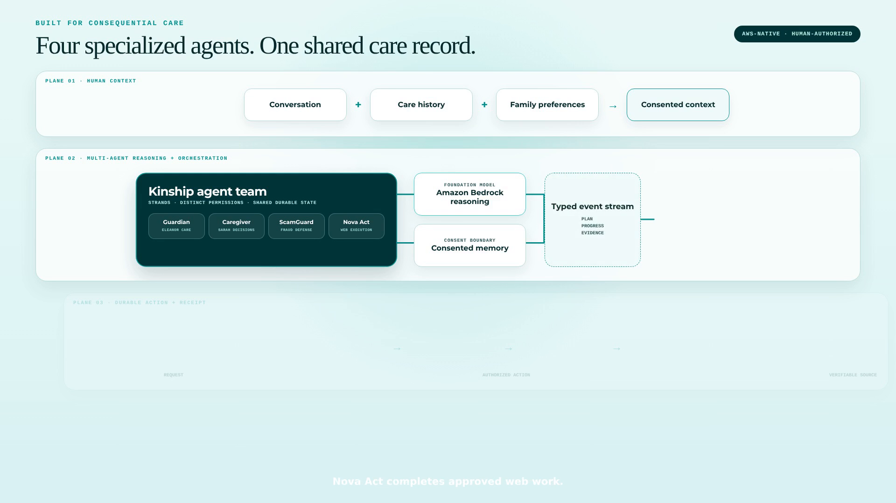
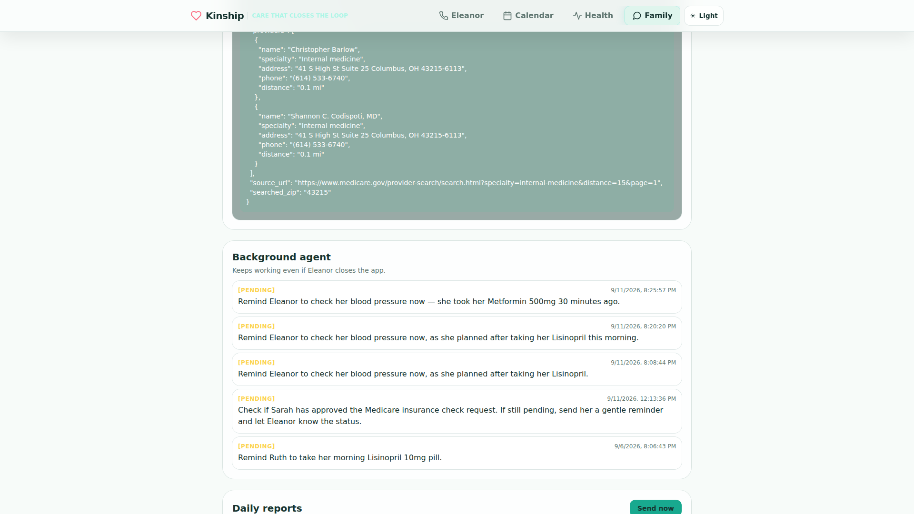

# Agents for Humans: Why Kinship Uses Four Agents Instead of One

An AI assistant can sound helpful while leaving every real task to the person who asked.

That failure is especially costly in family care. A caregiver does not need another chat window explaining that a medication might have been missed. They need the dose checked, the follow-up preserved, the right person notified only when necessary, and a reliable record of what happened.

For the AWS Agents for Humans Hackathon, I built **Kinship**, a voice-first care companion for older adults living independently and a decision surface for their families.

The core engineering question was not “How many tools can one agent call?” It was:

> Where should autonomy stop, and which agent should be trusted on each side of that boundary?

## Four roles, four trust boundaries

Kinship uses the Strands Agents SDK to organize four specialized roles:

| Agent | User or responsibility | Boundary |
| --- | --- | --- |
| Guardian | Supports Eleanor through voice and chat | Coordinates care tools but cannot silently execute consequential external actions |
| Caregiver | Helps Sarah understand status and manage care | Reads shared state through a narrower family-facing tool set |
| ScamGuard | Reviews suspicious caller and payment stories | Returns a structured risk assessment and protective language; caution beats certainty |
| Nova Act worker | Performs approved browser work | Starts only after explicit caregiver approval and must return evidence |

This is not a swarm of interchangeable chatbots. Each agent exists because it has a different audience, permission set, or failure cost.



## The Guardian’s tools are contracts

The Guardian coordinates 17 typed tools for medication schedules, intake confirmation, mood, memories, symptoms, health trends, reminders, welfare follow-up, notifications, appointments, scam review, compound-risk assessment, and browser-task requests.

Every Strands tool has a Zod schema and a narrow callback. Natural language is accepted at the edge, but state changes remain explicit.

For example, people say “I took my Metformin,” not a database identifier. The intake tool resolves the spoken name against Eleanor’s active schedule before writing. It also checks whether that dose has already been recorded that day. A second attempt is refused and becomes a visible family event rather than silently decrementing the pill count twice.

```typescript
export const confirmIntake = tool({
  name: "confirm_intake",
  inputSchema: z.object({
    userId: z.string(),
    medId: z.string(),
  }),
  callback: async ({ userId, medId }) => {
    const meds = await listMeds(userId);
    const taken = await takenMedIds(userId);
    const med = resolveMedication(meds, medId);

    if (!med) return JSON.stringify({ ok: false, error: "Medication not found" });
    if (taken.includes(med.id)) {
      await addEscalation(userId, "attention",
        `Double-dose prevented: ${med.name} was already logged.`);
      return JSON.stringify({ ok: false, alreadyTaken: true });
    }

    await storeConfirmIntake(userId, med.id, "agent");
    return JSON.stringify({ ok: true, medication: med.name });
  },
});
```

Strands gives Amazon Bedrock a controlled way to select and call these tools. The model reasons about Eleanor’s request; the tools enforce the product’s state and safety rules.

## A real specialist handoff

Suspicious stories have a different risk profile from ordinary companionship. The Guardian therefore delegates them through `check_scam`, which invokes a separate ScamGuard Strands agent with its own system prompt.

ScamGuard returns a structured verdict, a calm script Eleanor can follow immediately, and a short note for Sarah. The Guardian remains the conversational relationship; the specialist handles the narrow risk analysis.

```text
Eleanor → Guardian
              ├── ordinary care → typed Guardian tools
              ├── suspicious story → ScamGuard specialist
              └── external work → pending approval → Nova Act

Sarah → Caregiver Agent → shared care record
```

## Shared state, not whispered context

The agents do not coordinate by passing unstructured summaries to one another. Medication intake, health signals, conversations, approvals, tasks, alerts, and browser receipts live in PostgreSQL.

This matters because a promise can outlive a conversation. When Eleanor asks for a blood-pressure reminder in 30 minutes, the reminder becomes a durable task. Inngest carries it forward after the call ends. Sarah can see the task without supervising it, and she is interrupted only if follow-through fails or a decision is required.



The agent response is not the product. The complete loop is:

```text
notice → understand → ask → act → verify → remember
```

## Why AgentCore matters

Kinship includes a standalone TypeScript Guardian runtime deployed to Amazon Bedrock AgentCore. The live deployment proves that the same Strands-oriented care architecture can run beyond the Next.js request lifecycle.

For approved web work, a second AgentCore runtime gives Nova Act a managed browser environment. Sarah can watch the session, while typed progress and the final result return to the same durable task record.

AgentCore is valuable here for more than deployment. It makes consequential agent work observable.

## What I learned

1. **Specialize around permission boundaries, not personalities.** A new agent should correspond to a different user, capability, or failure mode.
2. **Keep durable truth outside the conversation.** Chat history helps continuity; typed state makes commitments reliable.
3. **Treat tools as safety boundaries.** Schema validation and database invariants matter more than persuasive prompting.
4. **Show the handoff.** People trust an agent more when they can see why it paused and who owns the next decision.
5. **Design failure as a product state.** “Could not verify” is safer and more useful than optimistic completion.

## Try Kinship

- Live app: https://kinship.arcumet.com
- Caregiver dashboard: https://kinship.arcumet.com/family
- Demo login: `caregiver@demo.local` / `demo1234`
- Source: https://github.com/Garinmckayl/kinship
- Competition video: add final public YouTube or Vimeo URL

Kinship is built with the Strands Agents SDK, Amazon Bedrock, Amazon Bedrock AgentCore, Amazon Nova Act, Next.js, PostgreSQL, and Inngest.

The architecture is intentionally less magical than an unrestricted autonomous agent. In care, that is the point: machine work should be persistent and capable; human authority should remain unmistakable.
