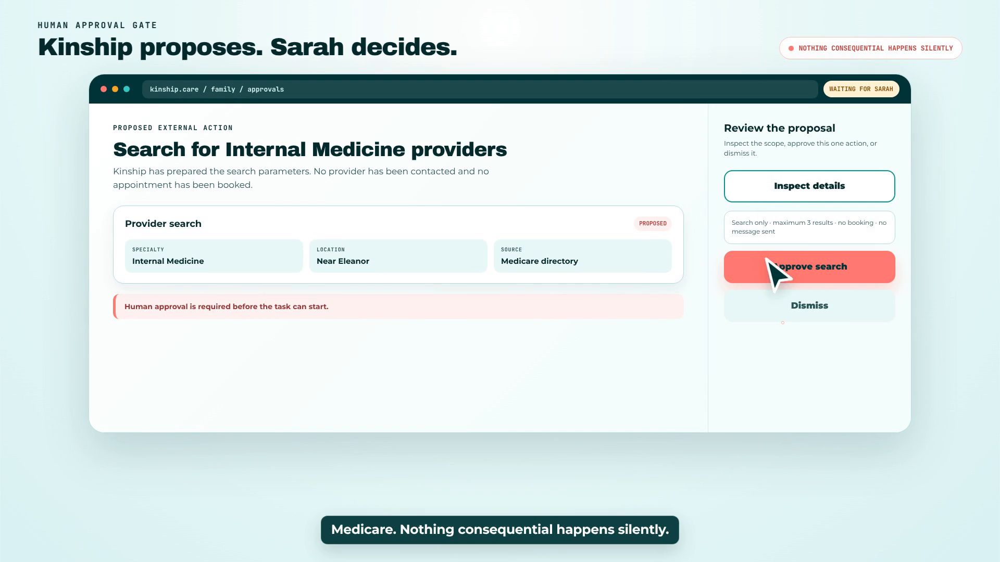

# Agents for Humans: From Approval to Evidence with Nova Act and AgentCore Browser

“The agent finished” is not proof that anything happened.

That lesson shaped the browser automation inside **Kinship**, the care agent I built for the AWS Agents for Humans Hackathon.

Kinship helps an older adult with recurring care tasks and gives their family a decision surface. Some work can happen quietly: checking a schedule, recording a medication, or preserving a reminder. External website actions are different. They can expose private information, create commitments, or produce a result the family may rely on.

So Kinship follows one rule:

> No consequential browser action without approval. No completion without evidence.

## The demonstration

The demo follows Eleanor, 79, and her daughter Sarah.

Kinship prepares a request to find nearby Internal Medicine clinicians who accept Medicare. Sarah sees the exact specialty, ZIP code, reason, and requested outcome. She can dismiss it or select **Approve & Execute**.

Only that click starts Amazon Nova Act.



Nova Act opens the official Medicare Care Compare site inside an Amazon Bedrock AgentCore Browser. It selects doctors and clinicians, enters Eleanor’s Columbus ZIP, filters for Internal Medicine, and reads the visible results.

Sarah can watch the real remote browser session while it works.


The output is not a success toast. Kinship presents a receipt with the search criteria, provider details, contact information, and source.


## The state machine behind the button

The browser workflow is a bounded state machine:

```text
pending_approval
       ↓ caregiver decision
approved
       ↓ execution begins
running + live browser
       ↓
completed + source-backed receipt
       or
failed + explicit error
```

The Strands Guardian agent can request browser work, but its tool always creates `pending_approval`. It cannot directly promote the task to running.

```typescript
export const requestBrowserTask = tool({
  name: "request_browser_task",
  inputSchema: z.object({
    userId: z.string(),
    taskType: z.enum([
      "provider_search",
      "pharmacy_refill",
      "insurance_check",
      "appointment_booking",
      "bill_payment",
      "grocery_order",
      "benefits_recert",
    ]),
    params: z.record(z.string(), z.unknown()),
    reason: z.string(),
  }),
  callback: async (input) => {
    const taskId = createTaskId();
    await saveBrowserTask(taskId, input.taskType, input.params,
      "pending_approval");
    return JSON.stringify({
      ok: true,
      taskId,
      status: "pending_approval",
      needsCaregiverApproval: true,
    });
  },
});
```

The approval endpoint is a separate family-side capability. That separation is more important than the visual button: it prevents the agent from approving its own request.

## The bug that made “done” untrustworthy

My first browser implementation had a subtle but dangerous flaw. The frontend and browser worker each created task identifiers, but the dashboard sometimes reconciled status by task type. If multiple provider searches existed, a completed sidecar task could make the wrong frontend card appear finished.

The UI looked successful. The state was not authoritative.

The fix was to store the browser worker’s exact `sidecar_task_id` on the frontend task and use it for every subsequent join:

- Progress belongs to that ID.
- The live-view URL belongs to that ID.
- Completion or failure belongs to that ID.
- The receipt belongs to that ID.

This changed the product from “a demo that usually looks right” into an auditable execution path.

## Streaming a browser that is not a video

AgentCore’s live browser view is a signed DCV/WebSocket session, not a normal MP4 or iframe URL. Kinship uses the official AgentCore live-view client, preserves the remote viewport, and keeps task polling separate from the live session lifecycle.

The session exists only while work is active. After completion, the expiring live URL disappears and the durable receipt remains.

That distinction keeps the UI honest:

- **Live view:** temporary evidence of work in progress.
- **Progress events:** typed execution state.
- **Receipt:** durable evidence of the outcome.

## Prompting for extraction, not optimism

For provider search, the Nova Act workflow receives a bounded instruction:

1. Use the official Medicare.gov Care Compare site.
2. Enter one validated five-digit ZIP code.
3. Search the exact requested specialty.
4. Extract only providers visible in the results.
5. Use empty values when a field is not shown; never invent it.
6. Return the source URL and searched ZIP with the provider list.

The worker returns typed data. The product then converts it into a readable receipt rather than exposing raw JSON.

## Honest breadth

Kinship contains approval-gated playbooks for provider search, prescription refills, insurance checks, appointments, verified bills, groceries, and benefits recertification.

The competition film labels provider search as the **live proof** because that is the workflow captured end to end on Medicare.gov. The others are presented as playbooks, not as transactions that already happened.

That wording matters. A trustworthy agent should distinguish implemented capability from verified outcome.

## What I learned

1. **Approval must be a separate capability.** A model should not authorize the work it proposed.
2. **Correlate by authoritative IDs.** Matching by task type or recent activity creates convincing but false completion states.
3. **Keep evidence after the session expires.** Live observability and durable auditability solve different problems.
4. **Failures deserve first-class UI.** A visible error is safer than a vague fallback success.
5. **Scope claims to captured proof.** The most persuasive demo is specific about what ran live.

## Try Kinship

- Live app: https://kinship.arcumet.com
- Caregiver dashboard: https://kinship.arcumet.com/family
- Demo login: `caregiver@demo.local` / `demo1234`
- Source: https://github.com/Garinmckayl/kinship
- Competition video: add final public YouTube or Vimeo URL

Kinship uses the Strands Agents SDK for bounded orchestration, Amazon Bedrock for reasoning, Amazon Nova Act for browser work, and Amazon Bedrock AgentCore Browser for secure, observable execution.

For consequential agents, trust is not a friendly tone. Trust is a chain the user can inspect: **request → approval → action → evidence**.
